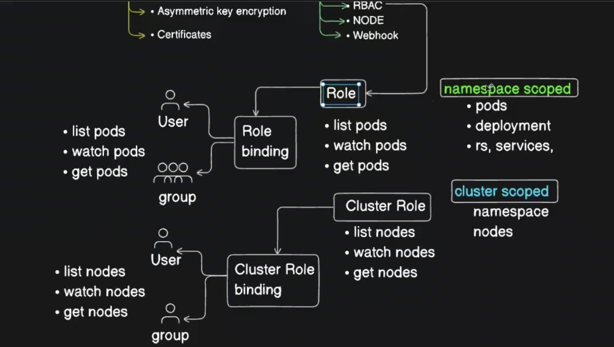

### 1. What is a ClusterRole?

A **ClusterRole** is a collection of permissions that defines **what actions a user, group, or service account can perform** on Kubernetes resources.

Unlike a **Role**, which works only inside a single namespace, a **ClusterRole** works across the entire cluster.


> A ClusterRole defines a set of permissions that can be applied cluster-wide or reused within one or more namespaces.

### Example

```yaml
apiVersion: rbac.authorization.k8s.io/v1
kind: ClusterRole
metadata:
  name: pod-reader

rules:
- apiGroups: [""]
  resources: ["pods"]
  verbs: ["get","list","watch"]
```

### Meaning

This ClusterRole allows:

| Verb  | Meaning             |
| ----- | ------------------- |
| get   | View a specific pod |
| list  | List all pods       |
| watch | Monitor pod changes |

But it does **NOT** allow: create, delete, update, patch


---

## 2. What is a ClusterRoleBinding?

A ClusterRole only defines permissions.

It does **not grant access to anyone** until it is attached to a user, group, or service account using a ClusterRoleBinding.


> A ClusterRoleBinding assigns a ClusterRole to a user, group, or service account across the entire Kubernetes cluster.

### Example

```yaml
apiVersion: rbac.authorization.k8s.io/v1
kind: ClusterRoleBinding
metadata:
  name: pod-reader-binding

subjects:
- kind: User
  name: developer1

roleRef:
  kind: ClusterRole
  name: pod-reader
  apiGroup: rbac.authorization.k8s.io
```

### Meaning

```text
developer1
      ↓
ClusterRoleBinding
      ↓
pod-reader ClusterRole
      ↓
Can view pods in all namespaces
```


---

# Role vs ClusterRole

| Feature                  | Role             | ClusterRole    |
| ------------------------ | ---------------- | -------------- |
| Scope                    | Single Namespace | Entire Cluster |
| Access Pods              | Yes              | Yes            |
| Access Nodes             | No               | Yes            |
| Access Namespaces        | No               | Yes            |
| Access Cluster Resources | No               | Yes            |

---

## Example 1: Read Pods Only in Dev Namespace

```yaml
### Role

kind: Role
metadata:
  namespace: dev

### RoleBinding

kind: RoleBinding
metadata:
  namespace: dev
```


---

## Example 2: Read Pods Across Entire Cluster

```yaml
### ClusterRole
kind: ClusterRole

### ClusterRoleBinding
kind: ClusterRoleBinding
```

Access:

```text
default namespace
kube-system namespace
monitoring namespace
dev namespace
prod namespace

All namespaces
```

---

# ClusterRole for Cluster Administration

```yaml
apiVersion: rbac.authorization.k8s.io/v1
kind: ClusterRoleBinding
metadata:
  name: admin-binding

subjects:
- kind: User
  name: admin-user

roleRef:
  kind: ClusterRole
  name: cluster-admin
  apiGroup: rbac.authorization.k8s.io
```

Kubernetes provides a built-in ClusterRole:

```text
cluster-admin
```

Permissions:

```text
✓ Create Pods
✓ Delete Pods
✓ Create Namespaces
✓ Delete Namespaces
✓ Create Deployments
✓ Delete Deployments
✓ Manage RBAC
✓ Full Cluster Control
```

---

# Common Built-in ClusterRoles

| ClusterRole   | Purpose                  |
| ------------- | ------------------------ |
| cluster-admin | Full admin access        |
| admin         | Namespace administration |
| edit          | Read + modify resources  |
| view          | Read-only access         |

---

# Visual Flow

```text
ClusterRole
(Defines Permissions)
        │
        ▼
ClusterRoleBinding
(Assigns Permissions)
        │
        ▼
User / Group / ServiceAccount
        │
        ▼
Can Access Kubernetes Resources
```


---

#### In Short

**ClusterRole**

* Defines permissions at the cluster level.
* Can access resources across all namespaces.
* Contains rules (resources + verbs).

**ClusterRoleBinding**

* Assigns a ClusterRole to a user, group, or service account.
* Grants the permissions defined in the ClusterRole.

