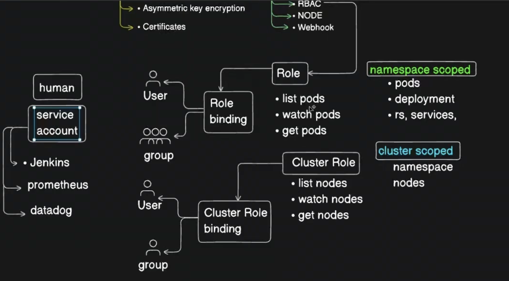

# Kubernetes RBAC with Service Accounts

#### What is a service account in Kubernetes

There are multiple types of accounts in Kubernetes that interact with the cluster. These could be user accounts used by Kubernetes Admins, developers, operators, etc., and service accounts primarily used by other applications/bots or Kubernetes components to interact with other services.

- To create a service account 
```
kubectl create sa name
kubectl get sa
```

- Then you can add role and role binding to grant access

>Note: Kubernetes also create 1 default service account in each of the default namespace such as kube-sytem, kube-node-lease and so on




#### What is a Service Account?

A **Service Account (SA)** is an identity used by **applications, pods, controllers, and automation tools** inside Kubernetes.

> A Service Account provides an identity for processes running inside a pod to communicate with the Kubernetes API Server.


| Identity Type   | Used By                  |
| --------------- | ------------------------ |
| User            | Human (Admin, Developer) |
| Service Account | Pod / Application        |


#### Why Do We Need a Service Account?

Suppose a pod needs to:

* Read ConfigMaps
* List Pods
* Create Jobs
* Access Kubernetes API

The pod cannot use a human user's credentials. Instead, Kubernetes provides a Service Account.


#### Default Service Account

- Every namespace automatically gets a default service account.
```bash
kubectl get sa
```
- If you don't specify a Service Account, the pod uses:
```yaml
serviceAccountName: default
```

---

### Implementation steps

#### Step 1: Create a Service Account

```yaml
apiVersion: v1
kind: ServiceAccount
metadata:
  name: pod-reader
  namespace: dev
```

Apply:

```bash
kubectl apply -f sa.yaml
```

Verify:

```bash
kubectl get sa -n dev
```

---

#### Step 2: Create a Role

Allow reading pods in the `dev` namespace.

```yaml
apiVersion: rbac.authorization.k8s.io/v1
kind: Role
metadata:
  namespace: dev
  name: pod-reader-role

rules:
- apiGroups: [""]
  resources: ["pods"]
  verbs: ["get","list","watch"]
```

Apply:

```bash
kubectl apply -f role.yaml
```

---

#### Step 3: Create RoleBinding

Attach the Role to the Service Account.

```yaml
apiVersion: rbac.authorization.k8s.io/v1
kind: RoleBinding
metadata:
  name: pod-reader-binding
  namespace: dev

subjects:
- kind: ServiceAccount
  name: pod-reader
  namespace: dev

roleRef:
  kind: Role
  name: pod-reader-role
  apiGroup: rbac.authorization.k8s.io
```

Apply:

```bash
kubectl apply -f rolebinding.yaml
```

---

#### Step 4: Use Service Account in Pod

```yaml
apiVersion: v1
kind: Pod
metadata:
  name: nginx
  namespace: dev

spec:
  serviceAccountName: pod-reader

  containers:
  - name: nginx
    image: nginx
```

Now:

```text
Pod
 ↓
ServiceAccount (pod-reader)
 ↓
RoleBinding
 ↓
Role
 ↓
Can read pods
```

---

#### Complete RBAC Flow

```text
ServiceAccount
      │
      ▼
RoleBinding
      │
      ▼
Role
      │
      ▼
Permissions
      │
      ▼
Kubernetes API
```

Example:

```text
pod-reader
     ↓
RoleBinding
     ↓
pod-reader-role
     ↓
get/list/watch pods
```

---

#### Cluster-Wide Access

If a Service Account needs cluster-wide permissions:

Use: ClusterRole + ClusterRoleBinding


##### ClusterRole

```yaml
apiVersion: rbac.authorization.k8s.io/v1
kind: ClusterRole
metadata:
  name: node-reader

rules:
- apiGroups: [""]
  resources: ["nodes"]
  verbs: ["get","list"]
```

##### ClusterRoleBinding

```yaml
apiVersion: rbac.authorization.k8s.io/v1
kind: ClusterRoleBinding
metadata:
  name: node-reader-binding

subjects:
- kind: ServiceAccount
  name: pod-reader
  namespace: dev

roleRef:
  kind: ClusterRole
  name: node-reader
  apiGroup: rbac.authorization.k8s.io
```

Now the pod can:

```bash
kubectl get nodes
```

because nodes are cluster-level resources.

---

##### Verify Service Account Permissions

```bash
# Check if a Service Account can perform an action:
kubectl auth can-i list pods \
  --as=system:serviceaccount:dev:pod-reader \
  -n dev

# Check node access:
kubectl auth can-i list nodes \
  --as=system:serviceaccount:dev:pod-reader  
  # output is no,  unless a ClusterRoleBinding exists.
```

---

#### Summary

| Object             | Purpose                     |
| ------------------ | --------------------------- |
| ServiceAccount     | Identity for Pods           |
| Role               | Namespace-level permissions |
| RoleBinding        | Assigns Role                |
| ClusterRole        | Cluster-wide permissions    |
| ClusterRoleBinding | Assigns ClusterRole         |


**Key point:**
A Service Account is the **user identity for a pod**, and RBAC determines what that pod is allowed to do inside the Kubernetes cluster.
