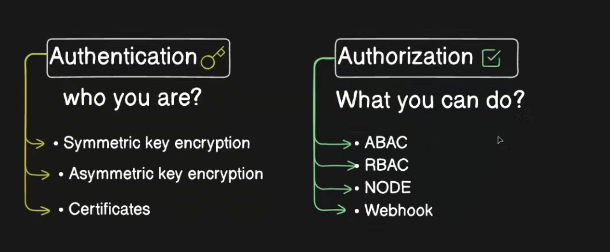

Authentication and Authorization are two different security steps in Kubernetes.

### 1. Authentication = "Who are you?"

When a user, application, or service tries to access the Kubernetes API Server, Kubernetes first checks their identity.

#### Common Authentication Methods

| Method                | Example                    |
| --------------------- | -------------------------- |
| Client Certificate    | Admin user certificate     |
| Service Account Token | Pod accessing API          |
| OpenID Connect (OIDC) | Azure AD, Okta, Google     |
| Static Token          | Token stored on API Server |
| Cloud IAM             | AWS IAM, Azure AD          |

#### Example

```bash
kubectl get pods
```

When you run this command:

1. kubectl sends request to API Server.
2. API Server verifies your certificate/token.
3. If valid → Authentication successful.
4. If invalid → Request rejected.

```text
User ----> API Server
          Verify Identity
```





### 2. Authorization = "What are you allowed to do?"

After identity is verified, Kubernetes checks permissions.

Example:

```text
User: John

Can View Pods?      YES
Can Delete Pods?    NO
Can Create Deployments? YES
```

This permission check is called Authorization.


#### Kubernetes Authorization Methods

| Method          | Description            |  Authorization
| --------------- | ---------------------- | -----------------------------------------------------
| RBAC            | Most commonly used     | (Role-Based Access Control): Create roles (like "dev") and assign users or groups to those roles
| ABAC            | Old method             | (Attribute-Based Access Control): Associates users with permissions but can be complex to manage
| Node Authorizer | For kubelets           | Ensures kubelets on nodes are authorized to communicate with the API server
| Webhook         | External authorization | Leverage external tools like OPA for more complex authorization logic

Most clusters use **RBAC**.


* **Authentication = Identity** = Authentication verifies your identity
* **Authorization = Permissions** = Authorization determines your access level


### Making API Calls:

To run a command against a cluster, you can use the below command
```
kubectl get pods --kubeconfig config
```

Normally, kubectl uses your local `$HOME/.kube/config` file for authentication so you dont have to pass the --kubeconfig parameter in every command. You can use below command
```
kubectl get pods
```

The below command shows an API call using raw arguments:

```
kubectl get --raw /api/v1/namespaces/default/pods \
  --server https://localhost:64418 \
  --client-key adam.key \
  --client-certificate adam.crt \
  --certificate-authority ca.crt
```


## Few testing commands

- ps -rf | grep control-plane                   # linux related, -rf used to check all running processes
- ps -ef | grep kube-apiserver                  # -ed used to get all running processes, grep is used to get specific process
- docker ps | grep control                      # grep the control plane to login
- docker exec -it <container name> bash           
- root@container: cd /etc/kubernetes/manifests  # default static pods manifest file stored in this path
- root@container: ls -lrt                       # all default files listed
    - etcd.yml
    - kube-apiserver.yml
    - kuber-controller-manager.yml
    - kube scheduller.yml
- cat kube-apiserver.yml
- root@container: cd /etc/kubernetes/pki        # all certificates default directory to keep store


